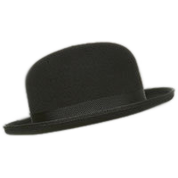
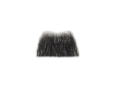
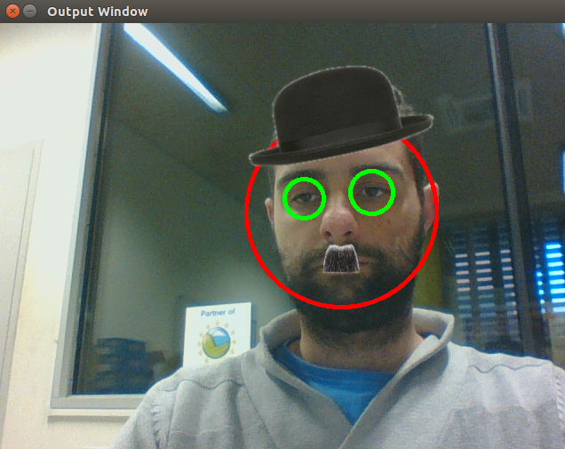

##FACE DETECTION

Este repositorio aplica librerias OPENCV para el reconocimiento de caras y ojos obtenidas mediante una webcam.

Siempre que escuche el término reconocimiento facial, inmediatamente piensa en la vigilancia en videos. 
Esta aplicación, contiene reconocimiento facial en Webcam! 
Para la parte de detección de rostros usaremos el impresionante CascadeClassifier y usaremos FaceRecognizer para el reconocimiento facial. Este repositorio utiliza el método de haarcascade para el reconocimiento facial, porque es robusto contra grandes cambios en la iluminación.

Los clasificadores utilizados son:

	Para ojos,  haarcascade_eye_tree_eyeglasses.
	Para caras, haarcascade_frontalface_default.

Para hacerlo mas atractivo, se carga en la imagen el gorro y el bigote de Charlie Chaplin, en cada uno de los rostros que identifique el clasificador.

&nbsp;&nbsp;&nbsp;&nbsp;   

&nbsp;&nbsp;&nbsp;&nbsp;   
	

Este es el resultado de aplicar los clasificadores.

&nbsp;&nbsp;&nbsp;&nbsp;   

Para mas información consultar.

http://docs.opencv.org/2.4/index.html

E